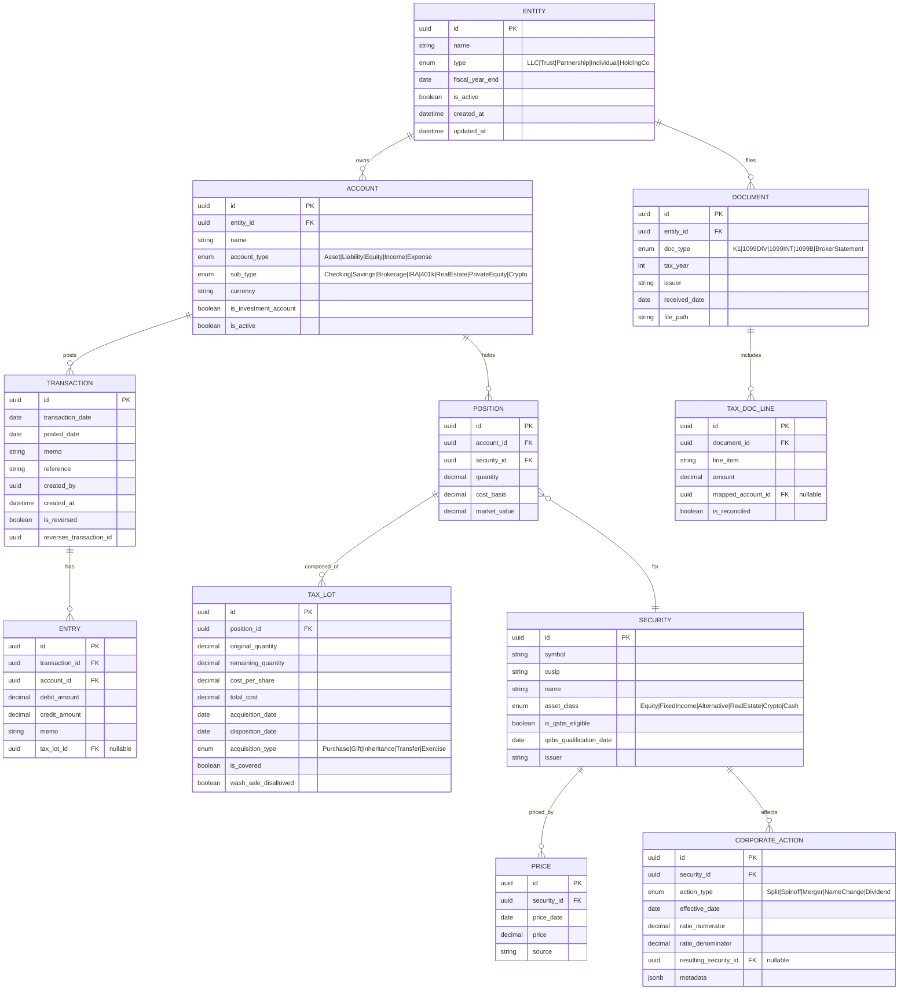

# Atlas Family Office Ledger PRD v1.0

## 1. Executive Summary

**Problem Statement:** Family offices manage complex multi-entity structures (LLCs, trusts, partnerships, holding companies) and diverse investment portfolios (public equities, fixed income, private equity, venture capital, real estate, alternatives, digital assets) using fragmented spreadsheets and consumer-grade tools. This leads to reconciliation errors, audit friction, inaccurate tax reporting, and lack of consolidated visibility.

**Solution Overview:** A double-entry, multi-entity accounting and investment ledger with rigorous tax-lot tracking, automated reconciliation, and consolidated reporting designed specifically for family office workflows.

**Success Metrics:**
- 95%+ reconciliation match rate for imported transactions
- <100ms median transaction recording latency
- <2s report generation time for 1000 transactions
- 90% test coverage on core domain logic

---

## 2. User Personas

### Primary: Family Office Administrator
- **Role:** Day-to-day operator responsible for transaction entry, reconciliation, and reporting
- **Goals:** Accurate books, timely reconciliation, audit-ready documentation
- **Pain Points:** Manual data entry, spreadsheet errors, multi-system reconciliation

### Secondary: Investment Manager
- **Role:** Oversees portfolio allocation and performance across entities
- **Goals:** Accurate position tracking, cost basis accuracy, performance attribution
- **Pain Points:** Inconsistent lot tracking, corporate action handling

### Secondary: Tax Advisor
- **Role:** Prepares tax returns and ensures compliance
- **Goals:** Accurate K-1/1099 reconciliation, capital gains reporting, QSBS tracking
- **Pain Points:** Data extraction, manual reconciliation to tax documents

### Secondary: Family Member (Read-Only)
- **Role:** Principal or beneficiary reviewing financial status
- **Goals:** Consolidated net worth visibility, performance summaries
- **Pain Points:** Lack of real-time visibility, fragmented reporting

---

## 3. User Stories & Acceptance Criteria

### US-001: Multi-Entity Management
> **As a** Family Office Administrator, **I want to** create multiple legal entities and assign accounts to them, **so that** reporting is accurate by entity and supports consolidated views.

**Acceptance Criteria:**
- [ ] Given a new entity with name and type (LLC/Trust/Partnership/Individual), when I save it, then it appears in the entity list
- [ ] Given an entity, when I create accounts, then each account is owned by exactly one entity
- [ ] Given multiple entities, when I run consolidated reports, then results include all entities with optional filters
- [ ] Given an entity marked inactive, when I run reports, then it is excluded by default but can be included

### US-002: Double-Entry Transaction Recording
> **As a** Family Office Administrator, **I want to** record transactions as balanced journal entries, **so that** the ledger maintains integrity and audit trail.

**Acceptance Criteria:**
- [ ] Given a transaction with entries, when saved, then sum of debits equals sum of credits
- [ ] Given an unbalanced transaction, when I attempt to save, then validation fails with clear error
- [ ] Given a saved transaction, when I view history, then original entry is immutable with timestamp and user
- [ ] Given a correction needed, when I post a reversing entry, then both entries are linked

### US-003: Investment Position Tracking
> **As an** Investment Manager, **I want to** record buys and sells with specific lot identification, **so that** cost basis matches custodian records exactly.

**Acceptance Criteria:**
- [ ] Given a buy transaction, when posted, then a new tax lot is created with acquisition date and cost
- [ ] Given multiple lots for a position, when I sell with FIFO method, then oldest lots are matched first
- [ ] Given multiple lots, when I sell with specific ID method, then only specified lots are reduced
- [ ] Given a partial sale, when posted, then remaining lot quantity equals original minus sold

### US-004: Corporate Action Processing
> **As an** Investment Manager, **I want to** record corporate actions (splits, spinoffs, mergers), **so that** position quantities and cost basis remain accurate.

**Acceptance Criteria:**
- [ ] Given a 2:1 stock split, when applied, then lot quantities double and per-share cost halves
- [ ] Given a spinoff, when recorded, then cost basis is allocated between parent and spinoff per ratio
- [ ] Given a merger (stock-for-stock), when processed, then old security lots convert to new security lots
- [ ] Given any corporate action, when applied, then audit trail shows before/after state

### US-005: Tax Document Reconciliation
> **As a** Tax Advisor, **I want to** reconcile K-1 and 1099 figures to ledger totals, **so that** tax filings are audit-ready.

**Acceptance Criteria:**
- [ ] Given a K-1 document, when I enter line items, then they map to ledger categories
- [ ] Given mapped K-1 data, when I run reconciliation, then differences are highlighted with drill-down
- [ ] Given a 1099-DIV, when reconciled, then dividend income matches ledger totals within tolerance
- [ ] Given mismatches, when I export exceptions, then report shows ledger vs document amounts

### US-006: QSBS Tracking
> **As a** Tax Advisor, **I want to** track Qualified Small Business Stock (QSBS) eligibility, **so that** Section 1202 exclusions are properly documented.

**Acceptance Criteria:**
- [ ] Given a security marked as QSBS-eligible, when I record acquisition, then holding period tracking begins
- [ ] Given QSBS shares held >5 years, when I view status, then eligibility is confirmed
- [ ] Given a QSBS sale, when capital gains calculated, then eligible exclusion amount is computed
- [ ] Given QSBS transferred between entities, when recorded, then holding period is preserved or reset per rules

### US-007: Consolidated Reporting
> **As a** Family Member, **I want to** view consolidated net worth across all entities, **so that** I understand overall financial health.

**Acceptance Criteria:**
- [ ] Given multiple entities, when viewing net worth report, then asset and liability totals are summed
- [ ] Given date range selection, when generating report, then balances reflect point-in-time values
- [ ] Given entity filter, when applied, then report shows only selected entities
- [ ] Given different fiscal years per entity, when consolidated, then data aligns to reporting period

### US-008: Reconciliation with External Data
> **As a** Family Office Administrator, **I want to** import bank/broker statements and reconcile automatically, **so that** ledger accuracy is verified efficiently.

**Acceptance Criteria:**
- [ ] Given a CSV/QFX file, when imported, then transactions are parsed and matched to existing entries
- [ ] Given a matched transaction, when confirmed, then it is marked reconciled with source reference
- [ ] Given an unmatched import, when reviewed, then I can create new transaction or flag exception
- [ ] Given duplicate import, when detected, then warning is shown and duplicates are not created

---

## 4. Domain Model

### Key Invariants (Business Rules)

These invariants must always hold and should be enforced at the domain layer:

1. **Position-Lot Consistency:** `sum(position.tax_lots.remaining_quantity) == position.quantity`
2. **Account Value Integrity:** `sum(account.positions.market_value) == account.total_market_value`
3. **Double-Entry Balance:** `sum(transaction.entries.debit_amount) == sum(transaction.entries.credit_amount)`
4. **Non-Negative Lots:** `tax_lot.remaining_quantity >= 0`
5. **Temporal Consistency:** `tax_lot.acquisition_date <= tax_lot.disposition_date` (when disposed)
6. **Entity Ownership:** Every account belongs to exactly one entity
7. **Immutable Transactions:** Once posted, transactions cannot be modified (only reversed)
8. **QSBS Holding Period:** QSBS eligibility requires `disposition_date - acquisition_date >= 5 years`

---

## 5. Feature Specifications

### 5.1 Core Ledger (Must Have)

#### Double-Entry Journal
- **Description:** All financial activity recorded as balanced journal entries with immutable audit trail
- **User Story Reference:** US-002
- **Input:** `Transaction{date, memo, entries: [{account_id, debit_amount, credit_amount, memo}]}`
- **Output:** Persisted transaction with generated ID; account balances updated
- **Edge Cases:**
  - Zero-amount entries (allowed for memo-only lines)
  - Multi-currency entries (convert at transaction date rate)
  - Backdated entries (recompute all affected balances)
  - Reversal entries (link to original, net to zero)
- **Acceptance Criteria:**
  - [ ] Debits must equal credits or transaction is rejected
  - [ ] Transaction timestamp and user are immutable after save
  - [ ] Balance queries return correct values after backdated entries

#### Multi-Entity Structure
- **Description:** Legal entities own accounts; supports consolidated and entity-level reporting
- **User Story Reference:** US-001
- **Input:** `Entity{name, type, fiscal_year_end}`
- **Output:** Entity with unique ID; accounts assignable to entity
- **Edge Cases:**
  - Entity deletion with existing accounts (must reassign or archive)
  - Entity type change (audit trail required)
  - Cross-entity transfers (create linked transactions in both entities)
- **Acceptance Criteria:**
  - [ ] Account creation requires valid entity_id
  - [ ] Entity deletion blocked if accounts exist (soft delete only)
  - [ ] Cross-entity transfers create balanced entries in both entity ledgers

### 5.2 Investment Tracking (Must Have)

#### Position & Tax Lot Management
- **Description:** Track investment positions composed of tax lots with full cost basis history
- **User Story Reference:** US-003
- **Input:** Trade transaction with security, quantity, price, lot selection method
- **Output:** Updated position; created/reduced tax lots
- **Lot Selection Methods:**
  - FIFO (First In, First Out)
  - LIFO (Last In, First Out)
  - Specific Identification
  - Average Cost (mutual funds only)
  - Minimize Gain
  - Maximize Gain
- **Edge Cases:**
  - Partial lot sales
  - Wash sale detection (sale at loss + repurchase within 30 days)
  - Lot transfer between accounts (preserve or reset basis per tax rules)
  - Fractional shares
- **Acceptance Criteria:**
  - [ ] Buy creates lot with acquisition_date = trade_date
  - [ ] Sell with FIFO matches oldest lot first
  - [ ] Sell with specific ID only touches specified lots
  - [ ] Wash sale within 30 days flags disallowed loss

#### Corporate Action Processing
- **Description:** Handle splits, spinoffs, mergers, and other corporate events
- **User Story Reference:** US-004
- **Input:** `CorporateAction{security_id, action_type, effective_date, ratio, resulting_security_id}`
- **Output:** Adjusted lots; new positions if spinoff/merger
- **Supported Actions:**
  - Stock split (forward and reverse)
  - Spinoff (cost basis allocation)
  - Merger (stock-for-stock conversion)
  - Name/symbol change
  - Share class conversion
- **Edge Cases:**
  - Fractional shares from split (cash-in-lieu)
  - Spinoff with multiple resulting securities
  - Merger with cash + stock consideration
- **Acceptance Criteria:**
  - [ ] Split adjusts all lot quantities by ratio
  - [ ] Split adjusts all lot cost_per_share inversely
  - [ ] Spinoff creates new position with allocated basis
  - [ ] All adjustments have audit trail with before/after

### 5.3 Reconciliation (Should Have)

#### Import & Match Engine
- **Description:** Import external statements and match to existing ledger entries
- **User Story Reference:** US-008
- **Input:** CSV, QFX, OFX file with transactions
- **Output:** Match results with confidence scores; exceptions list
- **Matching Algorithm:**
  - Exact match: same date, amount, account → 100% confidence
  - Near match: ±3 days, same amount → 80% confidence
  - Fuzzy match: ±7 days, amount within 1% → 60% confidence
- **Edge Cases:**
  - Duplicate imports (detect by reference/FITID)
  - Split transactions in source (one import → multiple ledger entries)
  - Currency conversion differences
- **Acceptance Criteria:**
  - [ ] Import parses standard CSV schema (date, payee, amount, account)
  - [ ] QFX/OFX files import with FITID deduplication
  - [ ] Matched items marked reconciled with source reference
  - [ ] Unmatched items surfaced for review

### 5.4 Tax Document Processing (Should Have)

#### K-1 / 1099 Reconciliation
- **Description:** Capture tax document data and reconcile to ledger categories
- **User Story Reference:** US-005
- **Input:** `TaxDoc{type, tax_year, issuer, line_items[]}`
- **Output:** Mapped line items; reconciliation report with variances
- **Supported Documents:**
  - K-1 (partnership/S-corp income)
  - 1099-DIV (dividends)
  - 1099-INT (interest)
  - 1099-B (brokerage sales)
- **Edge Cases:**
  - Amended K-1 (versioning)
  - Multi-state K-1 allocations
  - Wash sale adjustments on 1099-B
- **Acceptance Criteria:**
  - [ ] Line items map to ledger income/expense categories
  - [ ] Reconciliation shows ledger total vs document total
  - [ ] Variances beyond threshold flagged for review

### 5.5 Reporting (Should Have)

#### Standard Reports
- **Description:** Generate financial reports across entities and time periods
- **User Story Reference:** US-007
- **Report Types:**
  - Net Worth (assets - liabilities by entity/consolidated)
  - Balance Sheet (assets, liabilities, equity)
  - Income Statement / P&L
  - Cash Flow
  - Capital Gains (realized gains by lot, short/long term)
  - Position Summary (holdings with market value)
  - Tax Schedule (categorized by tax form)
- **Input:** Report type, date range, entity filter, account filter
- **Output:** Structured report data; exportable to CSV/PDF/Excel
- **Edge Cases:**
  - Multi-currency consolidation
  - Different fiscal year ends
  - Point-in-time historical reporting
- **Acceptance Criteria:**
  - [ ] Reports filter by entity, account, date range
  - [ ] Consolidated reports sum across entities correctly
  - [ ] Export to CSV preserves all data fields

---

## 6. Technical Constraints

| Constraint | Specification |
|------------|---------------|
| Language | Python 3.12+ |
| Type Safety | Strict mypy compliance required |
| Test Coverage | Minimum 90% for core domain logic |
| Local Storage | SQLite |
| Multi-User Storage | PostgreSQL |
| API Framework | FastAPI (for service layer) |
| Linting | Ruff (E, F, I, N, UP, B, C4, SIM rules) |
| Formatting | Ruff format, line-length 88 |
| Dependency Management | uv |

---

## 7. Non-Functional Requirements

### Performance
- Transaction recording: <100ms median latency
- Report generation (1000 txns): <2s
- Reconciliation matching (1000 imports): <5s
- Position valuation update: <500ms

### Data Integrity
- ACID compliance for all writes
- Immutable transaction history (append-only)
- Referential integrity enforced at database level
- Optimistic locking for concurrent updates

### Auditability
- All changes logged with timestamp and user ID
- Before/after state captured for updates
- Audit log queryable by entity, account, date range
- Retention: indefinite for financial data

### Security (Future)
- Authentication required for all operations
- Role-based access control (Admin, Manager, Viewer)
- Encryption at rest for sensitive data
- Audit log tamper protection

---

## 8. Out of Scope (v1)

| Feature | Rationale |
|---------|-----------|
| Tax return preparation | Specialized workflow requiring tax software integration |
| Bill pay | Consumer feature not central to family office accounting |
| Budgeting | Consumer feature; family offices focus on tracking actuals |
| Direct brokerage trading | Read-only tracking; execution via custodians |
| Real-time market data feeds | Manual or batch price updates sufficient for v1 |
| Multi-currency base reporting | Single reporting currency; FX conversion at transaction time |
| Mobile app | Desktop/web-first for complex workflows |

---

## 9. Open Questions

1. **Cost Basis Methods:** Are FIFO, LIFO, Specific ID, and Average Cost sufficient, or do we need HIFO (Highest In, First Out)?

2. **Wash Sale Automation:** Detection only, or automatic disallowed loss adjustment with basis transfer?

3. **Integration Scope:** File import only (CSV/QFX/OFX), or direct API connections to custodians (Schwab, Fidelity, etc.)?

4. **Multi-Currency:** Support multiple base currencies per entity, or single base currency with FX conversion?

5. **Approval Workflows:** Required for v1, or defer to v2? (e.g., transaction approval before posting)

6. **Document Storage:** Store actual documents (PDFs) or metadata/links only?

7. **Historical Data Migration:** What's the expected volume of historical data to import? (affects import tooling complexity)

---

## Appendix A: Competitive Reference (Quicken Features)

| Feature | Quicken Implementation | Atlas Adaptation |
|---------|----------------------|------------------|
| Account types | Checking, savings, credit, investment, asset, liability | Extended with entity ownership, sub-types for PE/VC/crypto |
| Cost basis | FIFO, LIFO, Min/Max gain, Avg cost | Add Specific ID, HIFO; mandatory lot tracking |
| Corporate actions | Split, spinoff, merger, name change | Same + better audit trail |
| Reconciliation | Manual + auto-reconcile to online balance | File-based import with matching engine |
| Reports | Banking, spending, investing, tax, net worth | Same categories + multi-entity consolidation |
| Import/Export | CSV, QIF, QFX/OFX | Same formats + structured API |

---

## Appendix B: Glossary

| Term | Definition |
|------|------------|
| Entity | Legal structure (LLC, trust, partnership) that owns accounts |
| Tax Lot | Specific purchase of shares with acquisition date and cost basis |
| FIFO | First In, First Out lot selection method |
| LIFO | Last In, First Out lot selection method |
| Specific ID | Manual selection of which lots to sell |
| QSBS | Qualified Small Business Stock eligible for Section 1202 exclusion |
| K-1 | Schedule K-1 tax form reporting partnership/S-corp income |
| Wash Sale | Sale at loss with repurchase within 30 days; loss disallowed |
| Cost Basis | Original purchase price plus adjustments; used for gain/loss calculation |
| Spinoff | Corporate action distributing shares of subsidiary to shareholders |
