# Family Office Ledger - Architecture Diagrams

## 1. Core Data Schema (Entity Relationship)

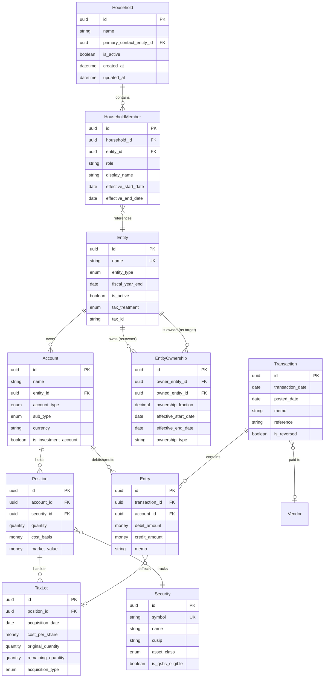

## 2. Ownership Graph Model (Addepar-style)

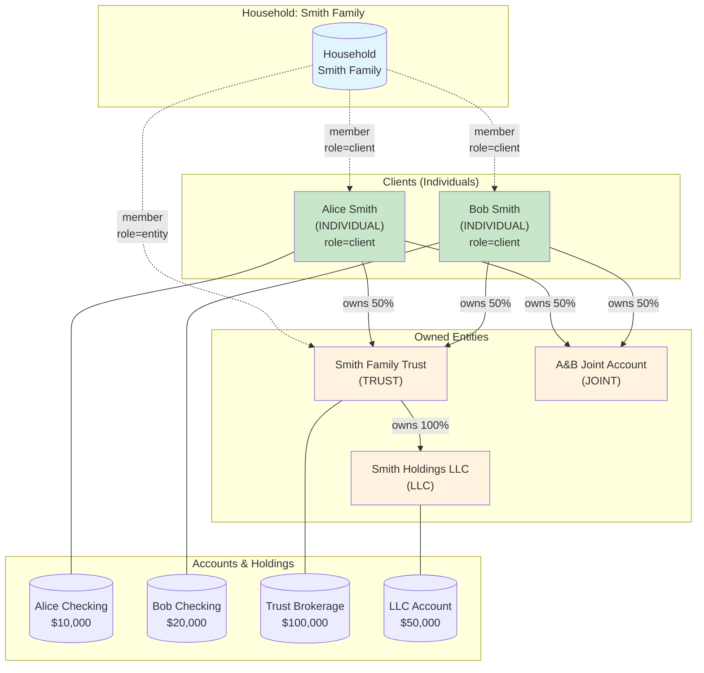

### Look-Through Net Worth Calculation

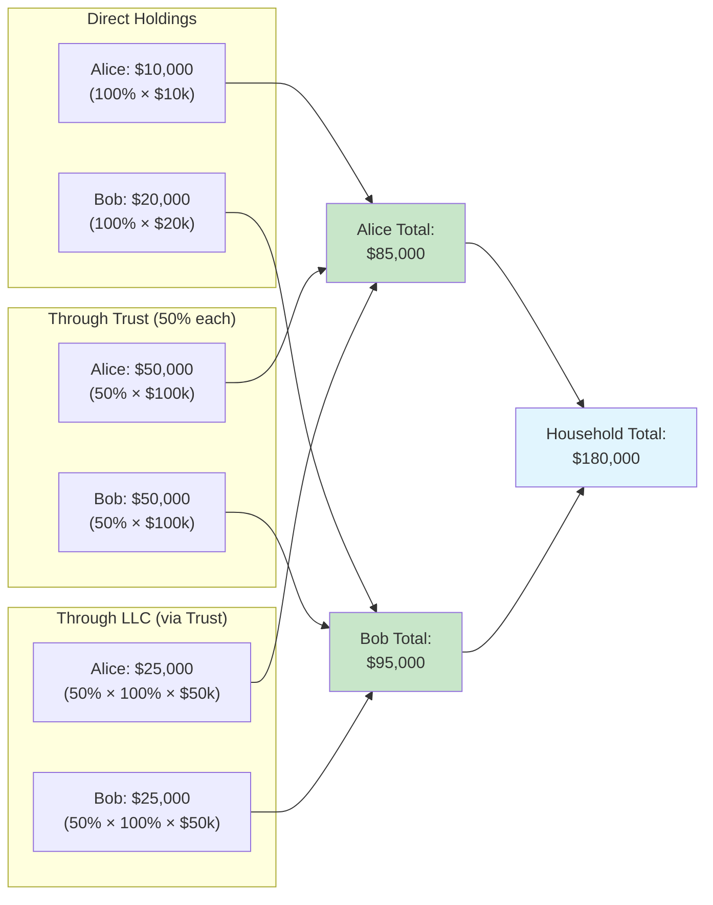

## 3. Double-Entry Transaction Flow

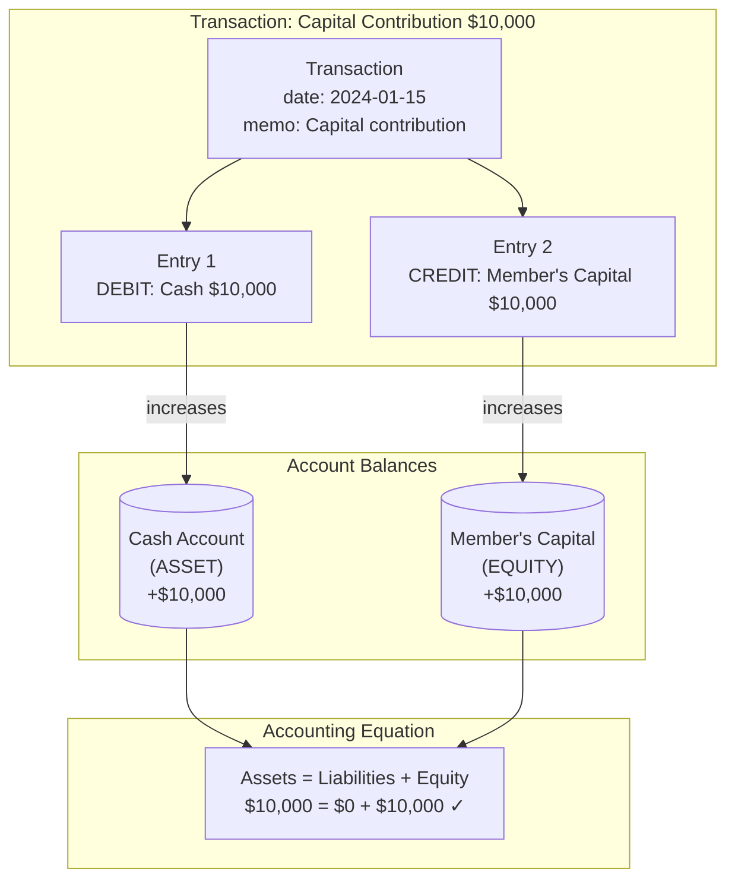

### Investment Purchase Flow

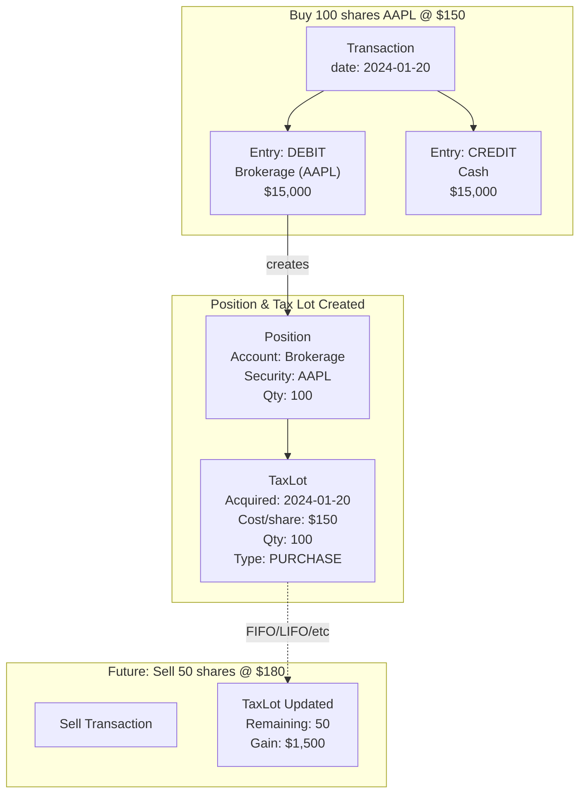

## 4. Reconciliation Workflow

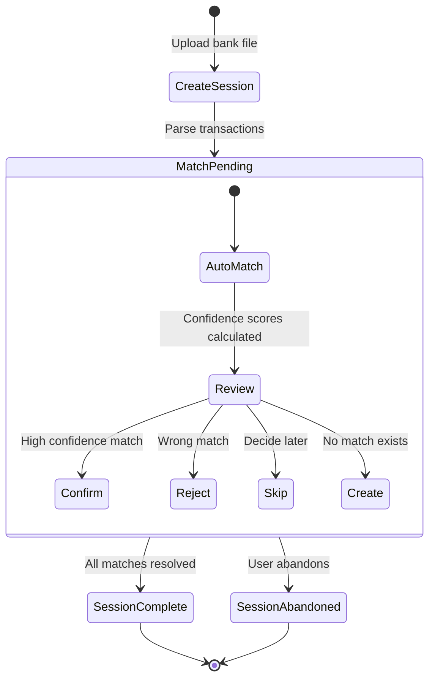

### Match Scoring Algorithm

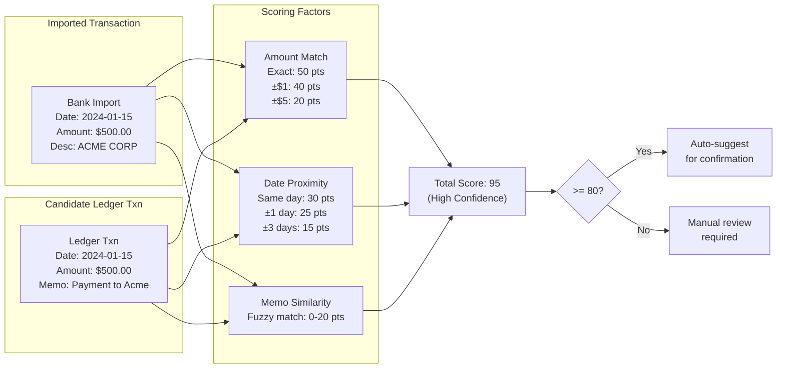

## 5. User Journey: Complete Workflow

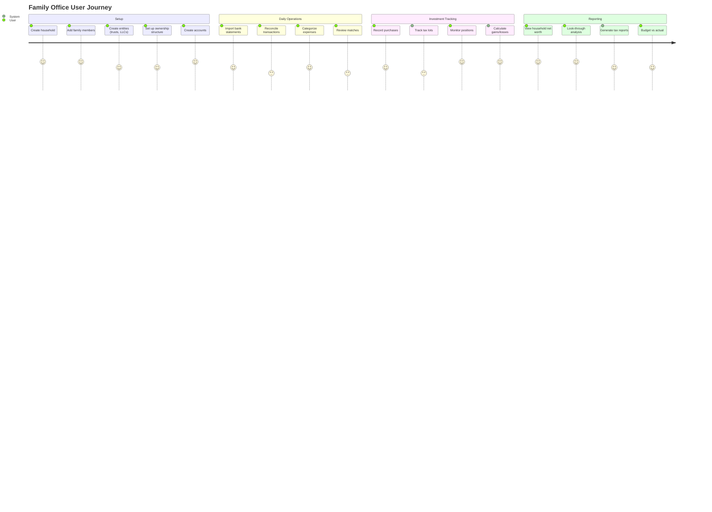

## 6. System Architecture (Layered)

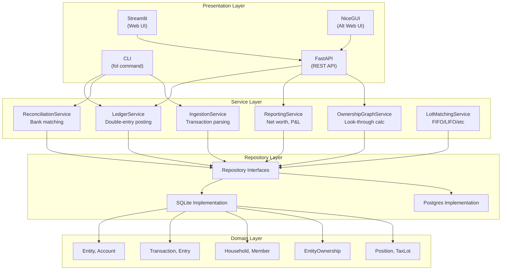

## 7. Entity Types & Tax Treatment

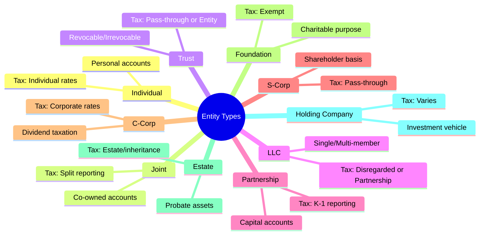

## 8. Account Type Hierarchy

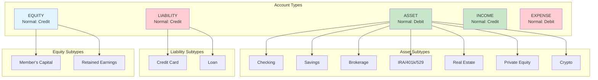

## 9. Diamond Ownership Pattern (Fixed Bug)

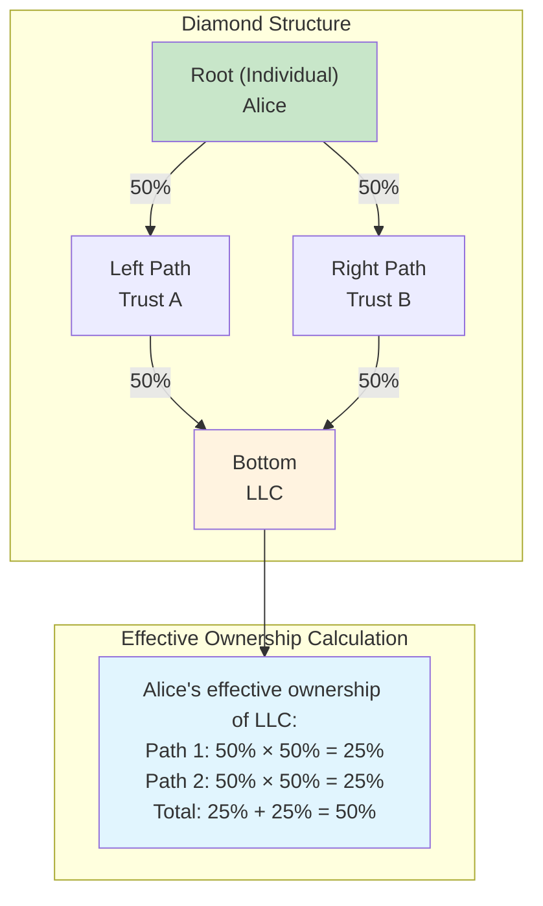
